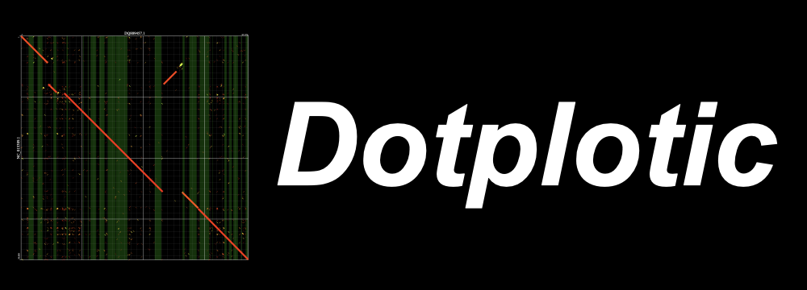

# Dotplotic

`Dotplotic` is a Perl script that converts BLAST search output file in tabular format into dot plot-like figure.  

## Features

- Converts BLAST search output file in tabular format into dot plot-like figure.
- Supports format conversin from SVG to PDF with Inkscape
- Uses only a few core Perl modules and is available as a single file

## Installation

```bash
gh repo clone HideyukiMiyazawa/Dotplotic
chmod a+x Dotplotic # or perl Dotplotic ...
```

## Geneaal usage

### Dotplotic
Dotplotic takes a BLAST search output file in tabular format (generated using the `-outfmt "6 std"` option) as input and produces an SVG file. It also supports reading from standard input.

```bash
Dotplotic --blast Blast.tsv > Dotplotic.svg
cat Blast.tsv | Dotplotic > Dotplotic.svg
blastn -query query.fa -subject subject.fa -outfmt "6 std" | Dotplotic > Dotplotic.svg
```

You can specify the sequences and regions to visualize either directly or by using file paths. Additionally, you can choose a sorting method: by name or by descending sequence length. If sequence lengths are not available in the BLAST file and you specify `length` for the `--query` or `--subject` option, the alignment region lengths will be used as a substitute for the full sequence lengths.
```bash
Dotplotic --blast Blast.tsv --query CP048983.1 --subject NC_001133.9 > Dotplotic.svg
Dotplotic --blast Blast.tsv --query CP048983.1:10000-20000 --subject NC_001133.9:10000-20000 > Dotplotic.svg
Dotplotic --blast Blast.tsv --query query.bed --subject subjects.bed > Dotplotic.svg
Dotplotic --blast Blast.tsv --query name --subject length -outfmt "6 std qlen slen" > Dotplotic.svg
```

Annotation files in GFF (.gff), BED (.bed), or OUT (.out) from RepeatMasker are supported. The specified regions will be shown as rectangles in the SVG output. You can provide multiple annotation files by separating them with commas, and optionally assign colors (`col`), opacity levels (`opac`), and labels for display in the plot (`name`). Standard input is also supported for annotations, using `--annotation -:fmt=gff`. (Note: When using standard input for annotations, you must specify the BLAST file with `--blast`, and explicity the annotation format (e.g., `gff` or `bed`) using `fmt`)
```bash
Dotplotic --blast Blast.tsv --annotation CDS.gff > Dotplotic.svg
Dotplotic --blast Blast.tsv --annotation CDS.gff:col=Red:opac=0.5:name=CDS,tRNA.gff:col=22FF33:opac=0.5 > Dotplotic.svg
cat CDS.gff | grep "transmembrane" | Dotplotic --blast Blast.tsv --annotation -:fmt=gff:name=transmembrane > Dotplotic.svg
```


If you enable the `click` option, information about objects in the plot (alignments and annotations) will be displayed when you click on them.
Alignment information follows the BLAST `6 std` format, while annotation information follows the GFF format.
```bash
Dotplotic --blast Blast.tsv --click > Dotplotic.svg
```

#### Options

| Option                | Description|Default value|
|-----------------------|------------|-------------|
| `--version`           | Display the program version.| - |
| `--help`              | Display the help message.| - |
| `--blast`             | Path to BLAST search output file in tabular format.| None.(required)|
| `--query`             | Path to a region file (.bed) or specify a region directly (e.g., "query1:1000-2000").|Off|
| `--subject`           | Path to a region file (.bed) or specify a region directly (e.g., "subject1:1000-2000").|Off|
| `--outfmt`            | Output format of the BLAST search.|`6 std`|
| `--annotation`        | Path to an annotation file (.gff, .bed or .out) to display regions on the plot.|Off|
| `--identity_range`    | Range of BLAST identity percentages to visualize|`60-100`|
| `--align_direction`   | Enable alignment of the direction of BLAST Alignments.|Off|
| `--auto_layout`       | Enable automatic modification of layout.|On|
| `--click`             | Enable showing the information of clicked objects.|Off|
| `--color_set_num`     | Number of color sets for objects (BLAST alignments and annotation data)|1|
| `--bg_color_set_num`  | Number of color sets for background elements (frame lines and text)|1|


### minimapsam2blast6.pl
You can use an alignment result in SAM format generated by minimap2 by converting it to BLAST tabular format with the `minimapsam2blast6.pl` script. This scfript tranforms the SAM file into BLAST `-outfmt 6 std qlen slen` style. It also supports reading from standard input.

```bash
minimapsam2blast6.pl --sam minimap2.sam > Blast.tsv
cat minimap2.sam | minimapsam2blast6.pl > Blast.tsv
```


The default method of identity calculation follows BLAST-like approach:


**Identity(%) = 100 - (sum of 'M' - (value of 'NM' - sum of 'I' - sum of 'D'))/(sum of 'M' + sum of 'I' + sum of 'D') x 100**


In a SAM file from Minimap2, the 6th column contains the CIGAR string: The sums of `M`, `I`, `D` represent the total number of matches, insertions, and deletions, respectively. The `NM` (edit distance to the reference) is provided in the 9th column.

If you specify `sub` as the `--identity` option, the identity will be calculated using the substitution rate:


**Identity(%) = 100 - ((value of 'NM' - sum of 'I' - sum of 'D')/sum of 'M') x 100**


```bash
minimapsam2blast6.pl --sam minimap2.sam --identity sub > Blast.tsv
```


### EditDotplotic.pl
If alignments of the BLAST file consists of many sequences, the `auto_layout` option can improve the layout, but it may be insufficient in cases, such as overlapping some sequence names, and long names of sequence is out of the plot. You can edit the SVG file with `EditDotplotic.pl` script.

```bash
EditDotplotic.pl delete query_seq_start Dotplotic.svg > Dotplotic.v2.svg
```

`EditDotplotic.pl` script can also read a config file consisting some commands, and edit a SVG file (see. [EditDotplotic.config.txt](./docs/EditDotplotic.config.txt)).

```bash
EditDotplotic.pl EditDotplotic.config.txt Dotplotic.svg > Dotplotic.v2.svg
```

For detailed information about `EditDotplotic.pl`, see [README.EditDotplotic.md](./docs/README.EditDotplotic.md).


## Converting to PDF

The output SVG file can be converted to PDF using software such as Adobe Illustrator. If you have Inkscape abailable from the command line, you can also convert SVG to PDF with the following command:

```bash
inkscape --export-type="pdf" Dotplotic.svg # Dotplotic.pdf will be generated
```

## Requirements

- Perl 5
- Perl modules:
  - `Getopt::Long`
  - `Pod::Text`


## Citation

Dotplotic: a lightweight visualization tool for BLAST+ alignments and genomic annotations
https://www.biorxiv.org/content/10.1101/2025.05.12.653581v1


## License

This script is released under the GNU General Public License v3.0 (GPL-3.0).  
See the [LICENSE](./LICENSE) file for details.
